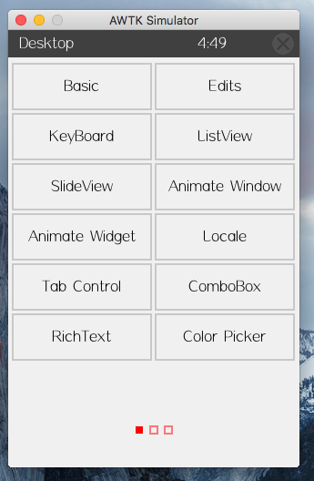

MAC
=====

如果没有安装scons和sdl2，请在终端运行下面的命令(假定已安装brew)：

.. code-block:: bash
    :caption: console运行
    :linenos:
    :emphasize-lines: 1,2,4

    brew install scons sdl2
    git clone https://github.com/zlgopen/awtk.git
    cd awtk
    scons -j8
    ./bin/demoui

.. list-table:: console运行
  :widths: 8 9 8
  :header-rows: 1

  * - 命令
    - 响应
    - 描述
  * - AT+MQTTCLIENTID=dtu
    - +ok
    - 设置客户端 ID(默认为设备的 SN)
  * - AT+MQTTUSERPWD=
    
      zq,zhaoqi
    - +ok
    - 设置客户端的用户名密码(默认为空[NULL])
  * - AT+MQTTWILL=
    
      will,willtest,0
    - +ok
    - 设置客户端遗嘱信息(默认为无遗嘱信息)
  * - AT+MQTTSTART=
    
      activemq.zhaoqi.info,1883
    - +mqtt: ok
      
      -- -- -- 

      +mqtt: err
    - 连接服务器

.. list-table:: console运行
  :widths: 15 10 
  :header-rows: 1

  * - 命令
    - 响应
  * - 设置命令
      
      AT+FSMOUNT=<fsid>

      fsid, 文件系统的 id

    - 设置成功:
      
      +ok
  * - 设置命令
      
      AT+FSMOUNT=<fsid>

      fsid, 文件系统的 id

    - 设置成功:
      
      +ok
  * - 设置命令
      
      AT+FSMOUNT=<fsid>

      fsid, 文件系统的 id

    - 设置成功:
      
      +ok

.. attention:: 在使用文件系统的其他指令前，必须调用本指令挂载文件系统。

.. note:: 

        +-----------------------+
        | 参数 fsid             |
        +===========+===========+
        | 0         | SD卡      |
        +-----------+-----------+
        | 1         | 板载FLASH |
        +-----------+-----------+

图 :ref:`run` 为AWTK在MACOSX 10.11.1上的运行截图:

.. _run:

    MAC运行图

