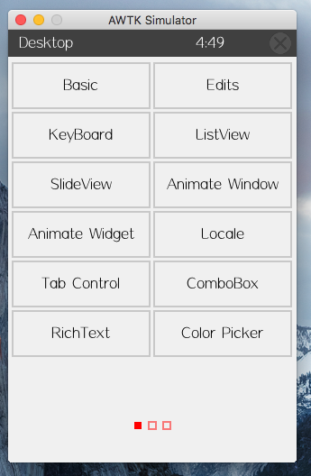

文本
=====

AWTK的文本部分包括label和richtext，下面讲解label和richtext的使用。

label
-------

定义与用法
```````````

<label>标签用于定义文本，通过style可以比较方便的控制label的显示方式。

实例
``````
.. code-block:: xml
    :caption: 显示基本label
    :linenos:
    :emphasize-lines: 1,2,4

    <window>
        <label name="label_basic" style="green" x="0" y="0" w="90" h="30" text="basic label"/>
    </window>

.. code-block:: xml
    :caption: 显示基本label的style
    :linenos:
    :emphasize-lines: 1,2,4

    <label>
      <style name="green">
        <normal text_color="green" font_size="30" text_align_h="left"/>
      </style>
    </label>

这样就显示了一个基本的label,
图 :ref:`run` 为AWTK在MACOSX 10.11.1上的运行截图:

.. _run:



    MAC运行图

